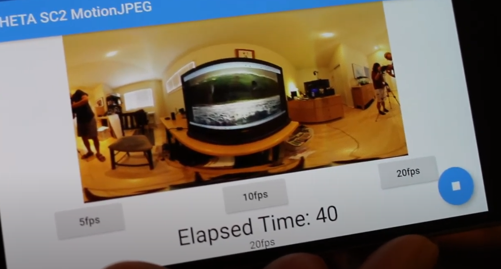
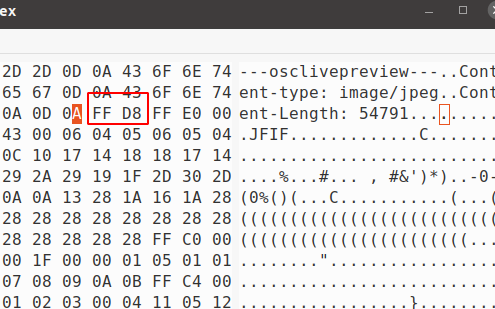

# RICOH THETA SC2 Live Preview

Last updated August 25, 2020.

This is a community document based on contributions of
informal test results 
from the [theta360.guide independent community](https://www2.theta360.guide/).  This is
not an official RICOH document.  For official information, please
contact RICOH.  You should confirm these community tips with your
own tests prior to deployment in a business setting.  As these are
unofficial tips, the official RICOH THETA API may change unexpectedly
and these techniques could stop working. 



## Problem 

The RICOH THETA SDK can't display camera.getLivePreview reliably.  
The moving live preview displayed to users before they take a picture stops.

## Workarounds

If you're using the SDK, there are EOFExceptions in readMJpegFrame() in 
the MJpegInputStream file.  The simple workaround is to call camera.getLivePreview
again after the error occurs.

On the SC2, camera.getLivePreview stops when specific API are given. 
Again, the workaround is to call camera.getLivePreview after you run
a commmand that stop the preview.

## Tests

We developed our own mobile app to test the SC2 getLivePreview 
behavior.

getLivePreview stops with the following commands: listFiles, takePciture,
startCapture, certain setOptions, and grabbing the file by URI.

A video overview of the application is 
[available on YouTube](https://youtu.be/5eSdqEudu5s).
You can also get an apk of the file to test on an Android device 
[here](http://bit.ly/theta-mjpeg-20200818).  The app was tested
on Pixel and Pixel2 running Android 10.

## Tips to Build Your Own App

The motionJPEG frames are extracted as JPEG and can then be saved to disk or displayed to screen. The start of the image is FF D8 or 0xFF, 0xD8.

The end of image is 0xff, 0xd9. Or, FF D9 in the hex screen.



```dart
client.send(request).then(
    (response) {
        var startIndex = -1;
        var endIndex = -1;
        List<int> buf = List<int>();
        videoStream = response.stream.listen((List<int> data) {
        if (playing) {
            hex.encode(data);
            for (var i = 0; i < data.length - 1; i++) {
            // print(data[i]);
            if (data[i] == 0xff && data[i + 1] == 0xd8) {
                startIndex = buf.length + i;
                frameStartIndex = i;
            }
            if (data[i] == 0xff && data[i + 1] == 0xd9) {
                endIndex = buf.length + i;
            }
            }
            buf.addAll(data);
            if (startIndex != -1 && endIndex != -1) {
            // print('$startIndex, $endIndex, ${buf.length}');
            timer.stop();
```

In the example above the HTTP request is a POST and has these elements:

* endpoint: `http://192.168.1.1/osc/commands/execute`
* header: `"Content-Type": "application/json; charset=UTF-8"`
* request body: `{"name": "camera.getLivePreview"}`


## Smooth Playback

In our tests, we had to implement the following packages
that are specific to Flutter.

* [precacheImage](https://api.flutter.dev/flutter/widgets/precacheImage.html) to 
put each JPEG frame into the image cache prior to displaying on the mobile
device screen.  Without this package, the screen would intermittently 
flash white.
* [gaplessPlayback](https://api.flutter.dev/flutter/widgets/Image/gaplessPlayback.html) to continue showing the old JPEG image frame when there is a problem receiving the next image in stream. As the frames would sometimes fail, the screen would
flicker. 

```dart
    Image cachedImage = Image.memory(
    Uint8List.fromList(
        buf.sublist(frameStartIndex, buf.length),
    ),
    gaplessPlayback: true,
    );
    precacheImage(cachedImage.image, context);
```

## Remaining Problems We are Still Working On

* Intermittent frame failture - Although the MotionJPEG stream plays smoothly in our demo, the frames do fail from time to time.  The app just waits for the next frame
and tries to display the next frame.  In actual practice, this works to provide the
appearance of smooth playback, but we're still trying to reduce the number of
failed frames.  We do not need to issue `camera.getLivePreview` when the frame fails.
The application and preview keep running.
* Error handling - We need to organize our error handling when there is a problem with the frame
* There might be a bug in the [http library](https://pub.dev/packages/http) we are using to send the request. The interesting part about the HTTP header request
is that it works on SC2, but not on the THETA V and the Z1.  On the V and Z1,
we are using the [dart:io HttpClient class](https://api.flutter.dev/flutter/dart-io/HttpClient-class.html), which is part of the standard io library from Google. 
The V and Z1 program didn't work with the SC2.  This indicates that there is
likely a small difference between the V/Z1 and the SC2 in how the headers are 
handled. We are trying to figure out what this difference is. 

## Summary

The SC2 provides a reliable MotionJPEG stream with camera.getLivePreview.
The stream is usable in mobile apps and is stable.  Several commands
will stop the stream.  This is the expected behavior and the solution is to
issue the camera.getLivePreview command again to restart the stream.

The SC2 livePreview doesn't work in the RICOH SDK.  However, the
V/Z1 do. This indicates that there is a small difference in the
HTTP request handler or response in the SC2. 
In our tests, the SC2 handled the HTTP request slightly differently
than the V/Z1, possibly due to a bug in the http library we used.  

As we have the SC2 working reliably with MotionJPEG, we decided to
send out this community update to help people test the SC2.  We intend
to send another update once we isolate the difference between 
the SC2 and V/Z1 request handling or response. 

---
This tip and many more SC2 developer articles are available on the 
[SC2 Developers Community Site](https://theta360.guide/special/sc2/).
Markdown to PDF conversion done with [Grip](https://github.com/joeyespo/grip). 

__This is not an official RICOH document. It is produced by
an independent community.  Please contact RICOH for official
information.__ 